# Windows Modern for KDE Plasma 6

A complete Windows 11-inspired visual transformation for KDE Plasma 6.

Windows Modern includes matching window decorations, widget styles, color schemes, Plasma desktop themes, global themes, an icon pack, custom applets, a panel layout template, and wallpapers — all available in **dark** and **light** variants.

> **Note:** This theme is designed for **KDE Plasma 6**. It will not work on Plasma 5.

## Screenshots

| Dark | Light |
|:---:|:---:|
| 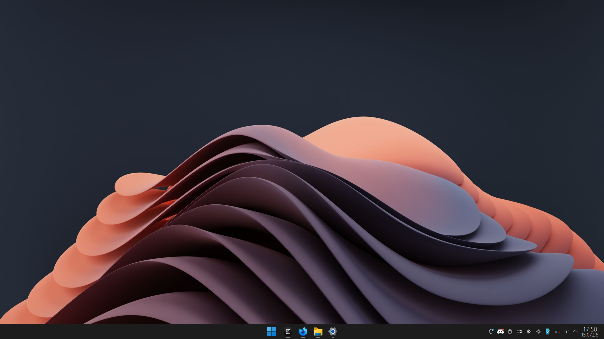 | 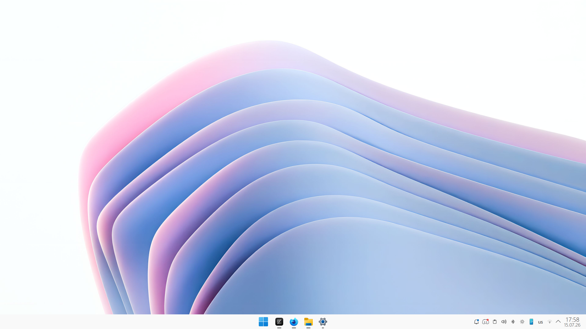 |
| *Desktop overview* | *Desktop overview* |
| 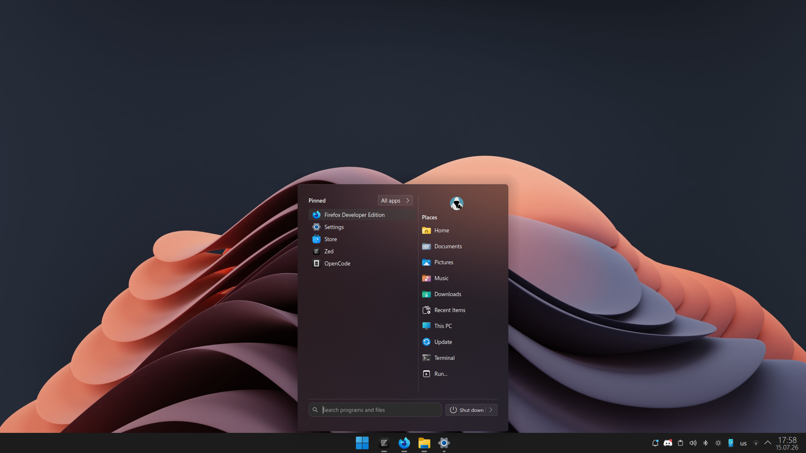 |  |
| *Start Menu — Pinned apps* | *Start Menu — Pinned apps* |
| 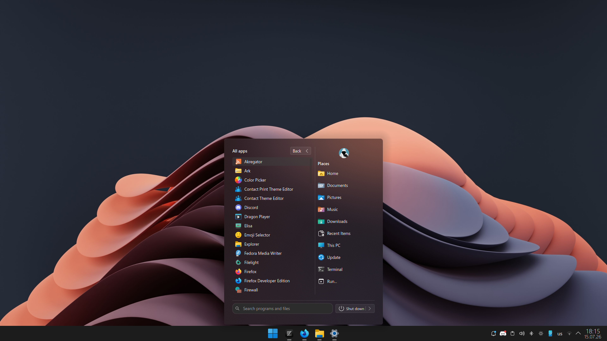 | 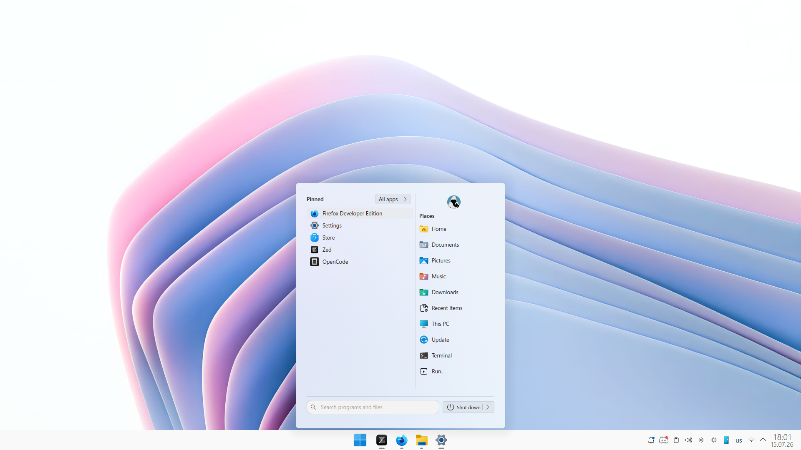 |
| *Start Menu — All Apps* | *Start Menu — All Apps* |
| 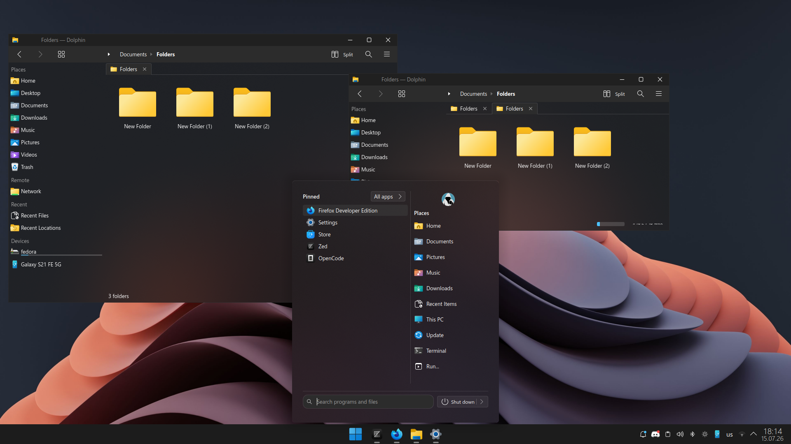 | 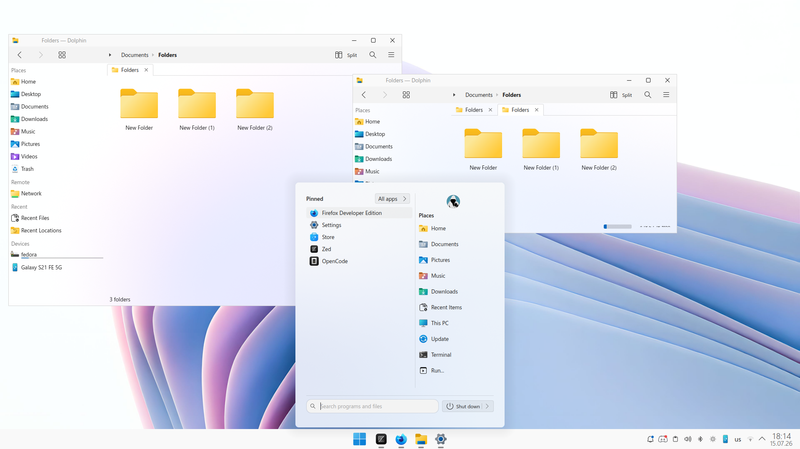 |
| *Start Menu with windows* | *Start Menu with windows* |
| 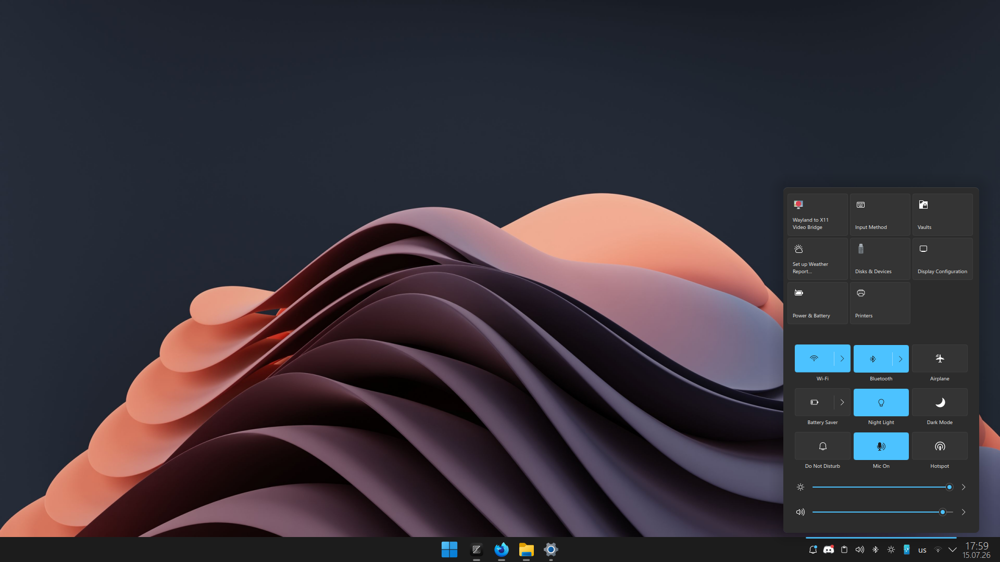 | 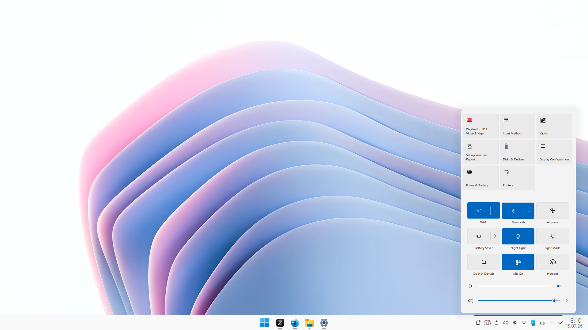 |
| *Quick Settings flyout* | *Quick Settings flyout* |
| 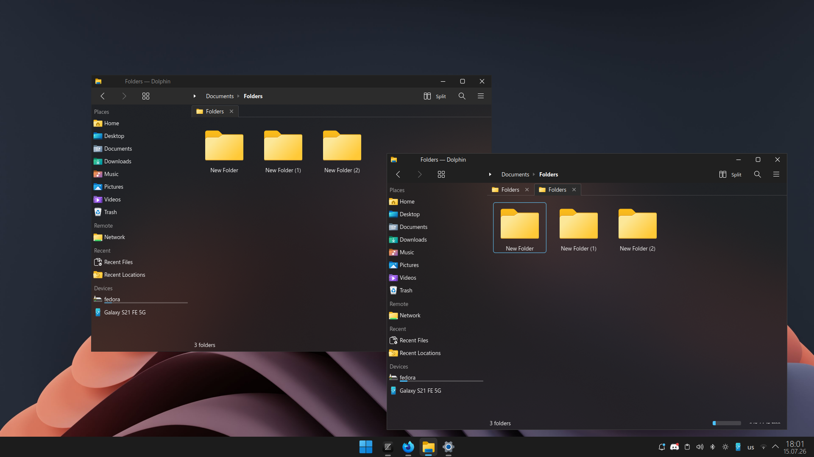 | 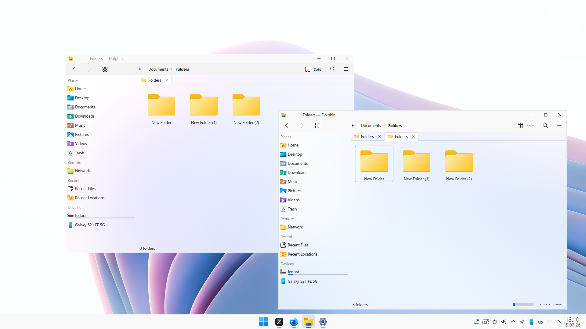 |
| *Window decorations* | *Window decorations* |

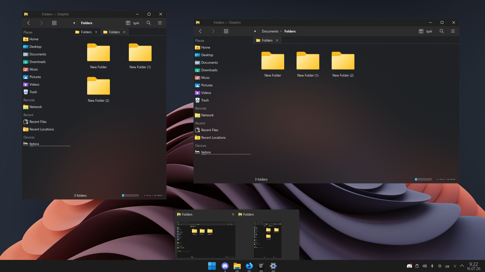
*Icon taskbar — hovering an icon on the icons-only taskbar reveals a Win11-style thumbnail tooltip with a per-tile close button. Dark variant shown.*

---

## What's included

| Component | Path | Description |
|-----------|------|-------------|
| **Aurorae window decorations** | `aurorae/` | Dark and light title bars with Win11-style caption buttons. |
| **Kvantum widget style** | `Kvantum/` | `Windows-modern` — ships both light and dark variants; KDE switches between them via `kvantum`/`kvantum-dark`. |
| **Plasma color schemes** | `color-schemes/` | `WindowsModernDark.colors`, `WindowsModernLight.colors`. |
| **Plasma desktop themes** | `plasma/desktoptheme/` | Full SVG theme sets for panels, widgets, tooltips, dialogs, switches, and tasks. |
| **Global themes** | `plasma/look-and-feel/` | `org.kde.windowsmodern.dark` and `org.kde.windowsmodern.light`. |
| **Panel layout template** | `plasma/layout-templates/` | A Win11-style bottom panel layout you can add from the desktop context menu. |
| **Custom applets** | `plasma/applets/` | Show Desktop, Start Menu, C++ System Tray, and C++ Icon Tasks (icons-only taskbar). |
| **Icon pack** | `icons/windows-modern/` | Curated Windows-11-style icon theme (~25,000 SVGs). |
| **Wallpapers** | `wallpaper/` | Dark and light variants. |
| **App decorations** | `app-decorations/` | Per-app CSD tweaks so non-KDE apps match the theme. Currently: Firefox `userChrome.css` window controls. |

---

## Requirements

- **KDE Plasma 6**
- **Kvantum** engine installed (`kvantum` package on most distros)
- For the **System Tray applet**: a C++ compiler and KDE/Plasma development packages (see [System Tray](#system-tray) below)
- For the **Icon Tasks applet**: a C++ compiler and a slightly different KDE/Plasma dev set (see [Icon Tasks](#icon-tasks) below)

---

## Installation

### Quick start (interactive)

```bash
./install.sh
```

This opens a menu where you can install everything, individual components, or just the applets.

### Install everything non-interactively

```bash
./install.sh all
```

### Install individual components

```bash
./install.sh themes      # Aurorae, colors, Kvantum, Plasma themes, wallpapers
./install.sh icons       # Icon pack
./install.sh lookfeel    # Global themes
./install.sh layout      # Panel layout template
./install.sh showdesk    # Show Desktop applet
./install.sh startmenu   # Start Menu applet
./install.sh systray     # System Tray applet (C++ — see below)
./install.sh icontasks   # Icon Tasks taskbar (C++ — see below)
./install.sh applets     # All four applets
```

---

## Applying the theme

1. Open **System Settings → Appearance → Global Theme**.
2. Select **Windows Modern Dark** or **Windows Modern Light**.
3. Click **Apply** (choose "Use desktop layout from theme" if prompted).
4. Open **System Settings → Appearance → Application Style** and set it to **Kvantum**.
5. Open **System Settings → Appearance → Icons** and select **windows-modern**.
6. Add the Windows Modern panel:
   - Right-click the desktop → **Add Panel → Windows Modern Panel**.
7. Enable floating for the authentic Win11 look:
   - Right-click the panel → **Show Panel Configuration → Floating → Applets Only**.
   - This can't be set automatically — Plasma's scripting API doesn't expose it.

If the panel layout is not available immediately after install, log out and back in.

---

## Applets

### Show Desktop

A thin 6-pixel sliver at the far right of the panel. Click it to minimize or restore all windows.

### Start Menu

A Win11-style start menu with Pinned apps, All Apps, and Search pages.

- Install: `./install.sh startmenu`
- Add it to the panel and remove the default Plasma menu.
- Implementation plan: [`docs/STARTMENU_PLAN.md`](docs/STARTMENU_PLAN.md)

### System Tray

A full C++ fork of the upstream Plasma system tray, themed to match Windows 11 and integrated with quick settings (network, Bluetooth, volume, brightness, battery, clipboard, notifications, devices, and media player).

Because it is a compiled Plasma Containment, it must be built during installation.

#### Install build dependencies

**Fedora:**

```bash
sudo dnf install gcc-c++ cmake extra-cmake-modules \
  qt6-qtbase-devel qt6-qtdeclarative-devel qt6-qtquickcontrols2-devel \
  kf6-kpackage-devel kf6-kconfig-devel kf6-ki18n-devel kf6-kcoreaddons-devel \
  kf6-kwindowsystem-devel kf6-kio-devel kf6-kiconthemes-devel \
  kf6-kitemmodels-devel kf6-kservice-devel kf6-kxmlgui-devel \
  kf6-kjobwidgets-devel kf6-kcmutils-devel \
  plasma-framework-devel plasma-workspace-devel plasma-workspace-libs \
  dbusmenu-qt6-devel
```

**Arch Linux:**

```bash
sudo pacman -S cmake extra-cmake-modules qt6-base qt6-declarative \
  kpackage kconfig ki18n kwindowsystem kio kiconthemes \
  kitemmodels kservice kxmlgui kjobwidgets kcmutils \
  plasma-framework plasma-workspace dbusmenu-qt6
```

**Debian/Ubuntu:**

```bash
sudo apt install cmake extra-cmake-modules \
  qt6-base-dev qt6-declarative-dev \
  libkf6package-dev libkf6config-dev libkf6i18n-dev \
  libkf6windowsystem-dev libkf6kio-dev libkf6iconthemes-dev \
  libkf6itemmodels-dev libkf6service-dev libkf6xmlgui-dev \
  libkf6jobwidgets-dev libkf6kcmutils-dev \
  libplasma-dev plasma-workspace-dev \
  libdbusmenu-qt6-dev
```

#### Build and install

```bash
./install.sh systray
```

For development, use the applet's own script:

```bash
cd plasma/applets/org.kde.windowsmodern.systemtray
./dev.sh
```

Detailed build instructions: [`plasma/applets/org.kde.windowsmodern.systemtray/BUILD.md`](plasma/applets/org.kde.windowsmodern.systemtray/BUILD.md)

### Icon Tasks

A C++ fork of the upstream icons-only task manager (`org.kde.plasma.taskmanager` from plasma-desktop), rebranded as `org.kde.windowsmodern.icontasks` and restyled with Windows 11 tooltip visuals. The C++ backend is preserved unchanged (jump lists, places, recent docs, app categories, smart launcher badges, audio stream matching); only the QML UI is restyled. This is the taskbar used by the Windows Modern panel layout template.

Win11 refinements over upstream:

- **Always icons-only** — `iconsOnly` is hardcoded to `true`.
- **Hidden subtext in thumbnail mode** — desktop/activity info ("On Desktop 2") is hidden when a window thumbnail is visible, since it's noise next to a live preview.
- **Subtle per-tile close button** — a minimal X pinned to the far right of the tooltip header. Background is transparent by default and turns Win11 red `#C42B1C` on hover; pressed is `#9E1B1B`.
- **Fixed-width, rounded thumbnail tiles** — PipeWire thumbnails are clipped to 8px rounded corners, tiles render at a fixed width, and inter-tile spacing matches the tooltip SVG margin for even gaps.

Because it is a compiled Plasma applet, it must be built during installation. The QML UI is embedded in the `.so`; a separate KPackage must **not** be installed — it causes rendering bugs.

#### Install build dependencies

The Icon Tasks dependency set differs slightly from the System Tray (it adds `plasma-activities`, `libksysguard`, and `knotifications`).

**Fedora:**

```bash
sudo dnf install gcc-c++ cmake extra-cmake-modules \
  qt6-qtbase-devel qt6-qtdeclarative-devel qt6-qtquickcontrols2-devel \
  kf6-kpackage-devel kf6-kconfig-devel kf6-ki18n-devel kf6-kcoreaddons-devel \
  kf6-kwindowsystem-devel kf6-kio-devel kf6-kservice-devel kf6-kxmlgui-devel \
  kf6-knotifications-devel \
  plasma-activities-devel plasma-activities-stats-devel \
  plasma-framework-devel plasma-workspace-devel \
  libksysguard-devel
```

**Arch Linux:**

```bash
sudo pacman -S cmake extra-cmake-modules qt6-base qt6-declarative \
  kpackage kconfig ki18n kwindowsystem kio kservice kxmlgui knotifications \
  plasma-activities plasma-activities-stats \
  plasma-framework plasma-workspace \
  libksysguard
```

**Debian/Ubuntu:**

```bash
sudo apt install cmake extra-cmake-modules \
  qt6-base-dev qt6-declarative-dev \
  libkf6package-dev libkf6config-dev libkf6i18n-dev \
  libkf6windowsystem-dev libkf6kio-dev libkf6service-dev libkf6xmlgui-dev \
  libkf6notifications-dev \
  libplasma-dev plasma-workspace-dev \
  plasma-activities-dev plasma-activities-stats-dev \
  libksysguard-dev
```

#### Build and install

```bash
./install.sh icontasks
```

For development, use the applet's own script:

```bash
cd plasma/applets/org.kde.windowsmodern.icontasks
./dev.sh
```

Detailed build instructions: [`plasma/applets/org.kde.windowsmodern.icontasks/BUILD.md`](plasma/applets/org.kde.windowsmodern.icontasks/BUILD.md)

---

## App decorations

Optional per-app stylesheets that make non-KDE apps blend in with the Windows Modern title bar. These are not applied by the installer — copy them into the app's config manually.

### Firefox

Replaces Firefox's CSD window buttons (minimize / maximize / restore / close) with flat white MDL2 SVGs and the Windows close-hover color (`#c42b1c`). Button size matches Aurorae metrics (46×30).

- Copy [`app-decorations/firefox/userChrome.css`](app-decorations/firefox/userChrome.css) into your Firefox profile's `chrome/` folder.
- In `about:config`, set `toolkit.legacyUserProfileCustomizations.stylesheets` to `true`, then fully restart Firefox.

Full instructions: [`app-decorations/firefox/README.md`](app-decorations/firefox/README.md)

---

## Uninstall and verify

```bash
./uninstall.sh all      # Remove everything
./uninstall.sh themes   # Remove theme components only
./uninstall.sh icons    # Remove icon pack
./uninstall.sh systray  # Remove system tray plugin
```

Run a project health check:

```bash
./verify-all.sh
```

---

## Development and contributing

### Committing icon pack changes

The `icons/windows-modern/` directory contains thousands of SVGs. To keep `git status` fast, those files are marked with `--skip-worktree` and `icons/**` is treated as binary in `.gitattributes`.

Never stage icon changes manually. Use the helper script:

```bash
COMMIT_MSG="feat(icons): describe your change" ./scripts/commit-icons.sh
```

The script temporarily re-enables tracking, stages the icon pack, commits with your message, then re-applies `--skip-worktree`.

### Building the System Tray locally

See [`plasma/applets/org.kde.windowsmodern.systemtray/BUILD.md`](plasma/applets/org.kde.windowsmodern.systemtray/BUILD.md) for the full manual build steps and distribution notes.

### Capturing README screenshots

```bash
./scripts/capture-screenshots.sh
```

Walks you through each desktop state (dark/light overview, start menu, system tray, window decorations) and captures optimized PNGs.

---

## Documentation

| Document | Description |
|----------|-------------|
| [`docs/STYLE.md`](docs/STYLE.md) | Complete visual style specification: palette, desktop theme, panel layout, applet specs, and repository structure. |
| [`docs/STARTMENU_PLAN.md`](docs/STARTMENU_PLAN.md) | Implementation plan for the Start Menu applet. |
| [`docs/SYSTEMTRAY_ARCHITECTURE.md`](docs/SYSTEMTRAY_ARCHITECTURE.md) | Architecture and history of the custom system tray. |
| [`docs/SYSTEMTRAY_DECISION.md`](docs/SYSTEMTRAY_DECISION.md) | Architecture decision record for the C++ fork approach. |
| [`docs/PLASMA_SYSTEMTRAY_ARCHITECTURE.md`](docs/PLASMA_SYSTEMTRAY_ARCHITECTURE.md) | Reverse-engineered upstream Plasma system tray internals. |
| [`docs/RELEASE.md`](docs/RELEASE.md) | How to publish a release to GitHub and the KDE Store. |
| [`plasma/applets/org.kde.windowsmodern.systemtray/BUILD.md`](plasma/applets/org.kde.windowsmodern.systemtray/BUILD.md) | System Tray build and install instructions. |
| [`plasma/applets/org.kde.windowsmodern.icontasks/BUILD.md`](plasma/applets/org.kde.windowsmodern.icontasks/BUILD.md) | Icon Tasks build and install instructions. |
| [`docs/icon-pack/README.md`](docs/icon-pack/README.md) | Icon theme consolidation pipeline overview. |

---

## Troubleshooting

### System Tray popup is a dark rectangle

This happens when the System Tray is installed as a KPackage instead of a compiled `.so` plugin. The install scripts remove conflicting KPackages automatically. If you see this:

```bash
./install.sh systray
systemctl --user restart plasma-plasmashell.service
```

### Changes to the System Tray have no effect

A stale local copy in `~/.local/lib64/qt6/plugins/plasma/applets/` or `~/.local/lib/qt6/plugins/plasma/applets/` can shadow the system plugin. The install scripts remove these automatically; otherwise delete them manually and restart Plasma.

### Icon Tasks taskbar is unstyled or thumbnails don't render

Same root causes as the System Tray: a conflicting KPackage was installed instead of the compiled `.so`, or a stale local `.so` (`org.kde.windowsmodern.icontasks.so`) is shadowing the system plugin. Re-run the installer, which prunes both:

```bash
./install.sh icontasks
systemctl --user restart plasma-plasmashell.service
```

### Window borders look wrong after install

The installer sets KWin borders to `Tiny`. If you changed it manually, re-run:

```bash
kwriteconfig6 --file kwinrc --group "org.kde.kdecoration2" --key "BorderSize" "Tiny"
kwriteconfig6 --file kwinrc --group "org.kde.kdecoration2" --key "BorderSizeAuto" "false"
dbus-send --session --dest=org.kde.KWin /KWin org.kde.KWin.reconfigure
```

### Restart Plasma Shell

```bash
systemctl --user restart plasma-plasmashell.service
```

---

## Credits

- **[yeyushengfan258](https://github.com/yeyushengfan258)** — original [Win11OS-kde](https://github.com/yeyushengfan258/Win11OS-kde) theme.
- **Jeysef** — Windows Modern fork, window decoration, popups, integration, and custom applets.
- **[Zren / Chris Holland](https://github.com/Zren)** — upstream Show Desktop applet (`win7showdesktop`).
- **[mjkim0727](https://github.com/mjkim0727/Eleven-icon-theme)** — **Eleven** icon pack (Windows 11 style icons).
- **[vinceliuice](https://github.com/vinceliuice/Fluent-icon-theme)** — **Fluent** icon pack.
- **[Eisteed](https://github.com/Eisteed/menu-11-next)** — **Menu11 - Next** start menu plasmoid (forked from [adhec/OnzeMenuKDE](https://github.com/adhec/OnzeMenuKDE)), used as a reference for the Windows Modern Start Menu.
- Additional icon pack sources are credited in
  [`ATTRIBUTION.md`](ATTRIBUTION.md).

---

## License

GNU GPL v3 — see [`LICENSE`](LICENSE).
